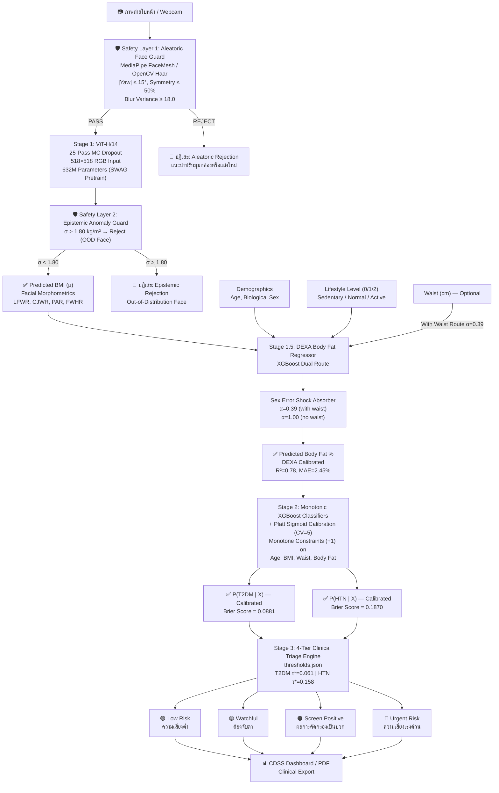

# Face2Health: ระบบคัดกรองความเสี่ยงทางสุขภาพแบบไม่รุกล้ำ และระบบสนับสนุนการตัดสินใจทางคลินิก (CDSS) แบบหลายโมดัล

[](https://www.python.org/downloads/release/python-3100/)
[-ee4c2c.svg)](https://pytorch.org/)
[](https://xgboost.readthedocs.io/)
[](https://streamlit.io/)
[](https://www.cdc.gov/nchs/nhanes/index.htm)
[](reports/Face2Health_IEEE_Conference_Paper.pdf)
[](LICENSE)

**Face2Health** คือระบบ Pipeline การคัดกรองทางคลินิกแบบครบวงจร ไม่รุกล้ำ และหลายโมดัล พร้อมทั้งเป็นตู้คีออสก์สนับสนุนการตัดสินใจสำหรับงานคัดแยกผู้ป่วย (Triage) ในระดับปฐมภูมิ ระบบผสานการทำงานของ **Vision Transformers (ViT-H/14 with Monte Carlo Dropout)**, **Scale-Invariant Facial Morphometrics**, และ **Tabular Monotonic Extreme Gradient Boosting (XGBoost)** โดยสอบเทียบกับฐานข้อมูลผู้ใหญ่หลายเชื้อชาติมาตรฐานทอง **CDC NHANES** ($N = 3{,}540$)

แพลตฟอร์มนี้มุ่งจัดการกับการดำเนินโรคแบบเงียบของโรคไม่ติดต่อเรื้อรัง (NCDs) ที่สำคัญ ได้แก่ **โรคเบาหวานชนิดที่ 2 (T2DM)** และ **ความดันโลหิตสูงชนิดปฐมภูมิ (Essential Hypertension)** โดยการแก้ปัญหา **"0-Recall Paradox"** ในการคัดกรองทางคลินิกผ่าน Platt scaling และจุดตัดสินใจ $F_2$-score ที่ผ่านการปรับค่าสำหรับการใช้งานทางคลินิก

---

## 📑 สารบัญ
1. [คุณสมบัติหลักและนวัตกรรมทางคลินิก](#-คุณสมบัติหลักและนวัตกรรมทางคลินิก)
2. [อินพุตและเอาต์พุตของระบบ End-to-End](#-อินพุตและเอาต์พุตของระบบ-end-to-end)
3. [สถาปัตยกรรมและทฤษฎีของ Pipeline](#-สถาปัตยกรรมและทฤษฎีของ-pipeline)
   - [โปรโตคอล Safety Guard สองชั้น](#1-โปรโตคอล-safety-guard-สองชั้น)
   - [Stage 1: ViT-H/14 Facial BMI & Morphometrics](#2-stage-1-face--bmi-ผ่าน-vit-h14-mc-dropout--facial-morphometry)
   - [Stage 1.5: DEXA Body Fat & Sex Error Shock Absorber](#3-stage-15-dexa-body-fat-regression--sex-error-shock-absorber-alpha--039)
   - [Stage 2: Monotonic Calibrated XGBoost Classifiers](#4-stage-2-monotonic-xgboost-classifiers--platt-calibration)
   - [การแก้ปัญหา 0-Recall Paradox ด้วย F2-Optimization](#5-การแก้ปัญหา-0-recall-paradox-ด้วย-f_2-score-utility-optimization)
4. [โปรโตคอลคัดแยก 4 ระดับ](#-โปรโตคอลคัดแยกทางคลินิก-4-ระดับ)
5. [โครงสร้าง Repository และรายการไฟล์](#-โครงสร้าง-repository-และรายการไฟล์)
6. [การติดตั้งและการตั้งค่าสภาพแวดล้อม](#-การติดตั้งและการตั้งค่าสภาพแวดล้อม)
7. [คู่มือการรันและจุดเริ่มต้นที่ใช้งานได้](#-คู่มือการรันและจุดเริ่มต้นที่ใช้งานได้)
   - [Entry Point 1: CDSS Kiosk Simulation Dashboard](#entry-point-1-cdss-kiosk-simulation-dashboard-run_dashboardbat)
   - [Entry Point 2: Production Health Screening App](#entry-point-2-production-health-screening-app-run_appbat)
   - [Entry Point 3: CLI Prediction Pipeline & Sanity Check](#entry-point-3-cli-pipeline-inference--sanity-checks)
   - [Entry Point 4: IEEE Academic Paper Compilation](#entry-point-4-ieee-academic-paper-compilation)
   - [Entry Point 5: Full Pipeline Retraining & ETL](#entry-point-5-data-etl--model-retraining-pipeline)
8. [ผลการประเมิน Benchmark บน Held-Out Test Set](#-ผลการประเมิน-benchmark-บน-held-out-test-set)
9. [ข้อจำกัดความรับผิดชอบทางการแพทย์และกฎระเบียบ](#-ข้อจำกัดความรับผิดชอบทางการแพทย์และกฎระเบียบ)
10. [กิตติกรรมประกาศและการอ้างอิง](#-กิตติกรรมประกาศและการอ้างอิง)

---

## 🌟 คุณสมบัติหลักและนวัตกรรมทางคลินิก

- **🛡️ โปรโตคอล Safety Guard สองชั้น:** ป้องกันการ hallucinate ของอัลกอริทึมด้วยการตรวจสอบท่าทางเชิงเรขาคณิตแบบ Real-Time ($|\text{Yaw}| \le 15^\circ$, $|\text{Roll}| \le 15^\circ$, อัตราส่วนสมมาตรระหว่างแก้ม $\le 0.50$) ควบคู่กับการตรวจจับความไม่แน่นอนเชิง Epistemic ($\sigma \le 1.80\text{ kg/m}^2$)
- **🧬 Scale-Invariant Facial Morphometry:** สกัดอัตราส่วนทางมานุษยวิทยาที่มีความสัมพันธ์กับไขมันในช่องท้องและไขมันใต้ผิวหนัง:
  - **LFWR** (Lower-Face Width to Face Height Ratio) — ตัวแทนของไขมันในช่องท้อง (*Lee & Kim 2014*)
  - **CJWR** (Cheek-to-Jaw Width Ratio) — ตัวบ่งชี้ไขมันแก้มและคาง (Buccal/Jowl fat pad) (*Coetzee 2009*)
  - **PAR** (Perimeter-to-Area Ratio) — ความกลมของขากรรไกร (Mandibular circularity) (*Wen & Guo 2013*)
  - **FWHR** (Facial Width-to-Height Ratio) — อัตราส่วนกระดูกบริเวณใบหน้ากลาง
- **🛡️ Biological Sex Error Shock Absorber ($\alpha = 0.39$):** เพศทางชีววิทยาครอบคลุม $74.99\%$ ของความแปรปรวนในการถดถอย DEXA body fat ดังนั้นสัญญาณรบกวนจากการประมาณ BMI จากใบหน้าจึงถูกลดทอนโดยธรรมชาติด้วยปัจจัย $\alpha = 0.39$ (เมื่อมีขนาดเอว) / $\alpha = 1.00$ (เมื่อไม่มีขนาดเอว) ป้องกันการขยายความผิดพลาดสู่ขั้นตอนถัดไป
- **⚖️ Monotonicity Constraints ($c_j = +1$):** บังคับให้พื้นผิวความเสี่ยงมีความสอดคล้องทางชีววิทยาสำหรับ Age, BMI, Waist Circumference, และ Body Fat กำจัดความผิดปกติแบบ step-function ที่ขัดกับความสมเหตุสมผลทางคลินิก
- **📈 การกำจัด 0-Recall Paradox:** จุดตัด ML มาตรฐาน ($\tau = 0.50$) ให้ค่า Sensitivity $0.0\%$ เนื่องจากข้อจำกัดของความชุกในประชากร ($\sim 10.3\%$) เมื่อใช้ Platt sigmoid scaling ร่วมกับจุดตัด $F_2$-score ที่ปรับบน validation cohort ($\tau^* = 0.061$ สำหรับ T2DM, $\tau^* = 0.158$ สำหรับ HTN) ระบบสามารถบรรลุ **Sensitivity $89.1\%$** สำหรับเบาหวาน และ **Sensitivity $88.4\%$** สำหรับความดัน โดยช่วยผู้ป่วยที่ถูกคัดออกผิดพลาด 49/55 และ 70/91 รายตามลำดับ
- **🏥 โหมดแอปพลิเคชันสองแบบ:**
  1. **Production Full-Stack Application (`scripts/app.py`):** โหลดน้ำหนัก PyTorch ViT-H/14 รับอินพุตจากเว็บแคม และส่งออกรายงาน PDF ทางคลินิกแบบสองภาษา
  2. **Standalone CDSS Kiosk Dashboard (`dashboard/app.py`):** เครื่องจำลองทางคณิตศาสตร์ที่แทบไม่มีความหน่วง ($< 0.05\text{s}$) เหมาะสำหรับสถานีพยาบาล ตู้คีออสก์ผู้ป่วยนอก และการสาธิตทางคลินิกแบบสด

---

## 🎯 อินพุตและเอาต์พุตของระบบ End-to-End

### อินพุตของระบบ

| พารามิเตอร์อินพุต | รูปแบบข้อมูล | ความจำเป็น | คำอธิบายและขอบเขตทางคลินิก |
|---|---|:---:|---|
| **ภาพถ่ายใบหน้า** | `.jpg`, `.jpeg`, `.png`, `.webp` หรือ Live Webcam | **จำเป็น** | ภาพใบหน้าตรง ผ่านการตรวจสอบจาก Two-Tier Safety Guard สำหรับท่าทาง ความเบลอ และแสง |
| **อายุตามปฏิทิน** | จำนวนเต็ม (12–99 ใน UI; 10–100 ใน backend) | **จำเป็น** | สอบเทียบกับโปรโตคอลกลุ่มตัวอย่างผู้ใหญ่ CDC NHANES |
| **เพศทางชีววิทยา** | Binary (`Male` / `Female`) | **จำเป็น** | เข้ารหัสเป็น `GENDER_NUM` (Male = 1, Female = 0) กำหนด DEXA shock absorber และจุดตัด body fat |
| **ระดับกิจกรรมทางกาย** | Categorical (`Sedentary`, `Normal`, `Active`) | **จำเป็น** | แมปไปยัง `LIFESTYLE_LEVEL` (0 = Sedentary, 1 = Normal, 2 = Active) ฝึกเป็น empirical feature |
| **ขนาดรอบเอว** | ทศนิยม (50.0–160.0 cm) | *ไม่บังคับ* | เปิดใช้ **Dual-Route Mode** (`with_waist` vs `no_waist`) สำหรับการประมาณไขมันในช่องท้อง |
| **Face Guard Bypass** | กล่องกาเครื่องหมาย Boolean | *ไม่บังคับ* | อนุญาตให้ผู้ใช้เลี่ยงระบบตรวจสอบสำหรับภาพที่ไม่ผ่านมาตรฐาน พร้อมแจ้งเตือนทางคลินิก |

### เอาต์พุตที่คาดหวังจาก Pipeline

| ขั้นตอน Pipeline | เมตริกเอาต์พุต | หน่วย / รูปแบบ | การตีความทางคลินิกและการแบ่งกลุ่ม |
|---|---|---|---|
| **Stage 1 (ViT-H/14)** | BMI ที่ทำนาย ($\mu$) | $\text{kg/m}^2$ (Float) | WHO Asian Classification: น้ำหนักต่ำกว่าเกณฑ์ ($<18.5$), ปกติ ($18.5–23$), น้ำหนักเกิน ($23–25$), อ้วน ($\ge 25$) |
| **Stage 1 (ความไม่แน่นอน)** | Epistemic Uncertainty ($\sigma$) | $\pm\text{SD}$ (Float) | MC Dropout 25 รอบ Guard จะสกัดกั้นหาก $\sigma > 1.80\text{ kg/m}^2$ |
| **Stage 1 (Morphometry)** | Facial Ratios (LFWR, CJWR, PAR, FWHR) | Float Ratios | ตัวแทนทางกายวิภาคที่ไม่ขึ้นกับสเกลสำหรับไขมันในช่องท้องและไขมันแก้ม |
| **Stage 1.5 (XGBoost)** | Total Body Fat % | % (Float) | สอบเทียบกับมาตรฐานทอง DEXA แบ่งกลุ่มตามเพศ: Lean, Fit, Acceptable, Obese |
| **Stage 2 (Classifiers)** | Calibrated T2DM Risk ($P$) | % ความน่าจะเป็น (0–100%) | Posterior probability ที่สอบเทียบด้วย Platt สำหรับโรคเบาหวานชนิดที่ 2 |
| **Stage 2 (Classifiers)** | Calibrated HTN Risk ($P$) | % ความน่าจะเป็น (0–100%) | Posterior probability ที่สอบเทียบด้วย Platt สำหรับความดันโลหิตสูงชนิดปฐมภูมิ |
| **Stage 3 (Triage)** | ระดับการคัดแยกทางคลินิก | 4 ระดับ | **ความเสี่ยงต่ำ** (🟢), **ต้องจับตา** (🟡), **Screen Positive** (🟠), **ความเสี่ยงเร่งด่วน** (🔴) |
| **Export Engines** | PDF / IEEE Paper | `.pdf` / `.docx` | รายงานสรุปผู้ป่วยพร้อมคำแนะนำยืนยันผลทางคลินิก หรือบทความวิชาการ IEEE |

---

## 🔄 สถาปัตยกรรมและทฤษฎีของ Pipeline



### 1. โปรโตคอล Safety Guard สองชั้น
- **Safety Layer 1 (Aleatoric Guard — ท่าทางและแสงสว่าง):** มุมมองที่ไม่ตรงหน้าทำให้เกิดความเพี้ยนจากการซ้อนทับมุมมอง (Parallax Distortion) MediaPipe FaceMesh ตรวจสอบว่ามุม Yaw $|\text{Yaw}| \le 15^\circ$, มุม Roll $|\text{Roll}| \le 15^\circ$, และความไม่สมมาตร $\Delta_{\text{sym}} \le 50\%$ พร้อมกันนั้นภาพต้องมี Laplacian variance $\text{Var}(\nabla^2 I) \ge 18.0$ และความสว่างปกติ ($55 \le \bar{I} \le 212$)
- **Safety Layer 2 (Epistemic Guard — การตรวจจับ Out-of-Distribution):** Monte Carlo Dropout สุ่มตัวอย่างจาก 25 รอบ stochastic forward pass หาก epistemic standard deviation $\sigma > 1.80\text{ kg/m}^2$ โครงสร้างใบหน้าจะถูกระบุว่าเป็น Out-of-Distribution (OOD) สำหรับ Vision Transformer และบล็อกการคัดกรองขั้นต่อไปเพื่อป้องกัน hallucination ของอัลกอริทึม

### 2. Stage 1: Face → BMI ผ่าน ViT-H/14 MC Dropout & Facial Morphometry
- **ViT-H/14 Backbone:** ประมวลผล tensor RGB ขนาด $518 \times 518$ แบบ bicubic โดยใช้น้ำหนัก ImageNet-1K SWAG ที่ผ่านการ pre-train (`IMAGENET1K_SWAG_E2E_V1`)
- **สถาปัตยกรรม Regression (`BMIHead`):**
  $$\text{Input (1280)} \xrightarrow{\text{FC}} 640 \xrightarrow{\text{GELU}} \text{Dropout}(0.5) \xrightarrow{\text{FC}} 320 \xrightarrow{\text{GELU}} 160 \xrightarrow{\text{GELU}} 80 \xrightarrow{\text{GELU}} 1$$
- **ตัวชี้วัด Morphometric:**
  $$\text{CJWR} = \frac{\text{Bizygomatic Width}}{\text{Bigonial Width}}, \quad \text{LFWR} = \frac{\text{Bigonial Width}}{\text{Lower Face Height}}, \quad \text{PAR} = \frac{\text{Jawline Perimeter}}{\sqrt{\text{Jawline Area}}}$$

### 3. Stage 1.5: DEXA Body Fat Regression & Sex Error Shock Absorber ($\alpha = 0.39$)
- **สูตร Dual Route:**
  - Route A (`with_waist`): Features = `['BMI', 'AGE', 'GENDER_NUM', 'WAIST_CM', 'LIFESTYLE_LEVEL']`
  - Route B (`no_waist`): Features = `['BMI', 'AGE', 'GENDER_NUM', 'LIFESTYLE_LEVEL']`
- **ผลของ Error Shock Absorber:** เพศทางชีววิทยาครอบคลุม $74.99\%$ ของความแปรปรวนในการถดถอย DEXA total body fat ($R^2 = 0.78$, $\text{MAE} = 2.45\%$) Gradient ของค่าประมาณ body fat ต่อ BMI จากใบหน้าถูกจำกัดไว้ที่:
  $$\frac{\partial \hat{y}_{\text{fat}}}{\partial \hat{y}_{\text{BMI}}} \approx \alpha = 0.39 \quad (\text{เมื่อมีขนาดเอว}), \quad \alpha = 1.00 \quad (\text{เมื่อไม่มีขนาดเอว})$$
  ซึ่งลดความแปรปรวนจากการมองเห็นลงกว่า $60\%$ ป้องกัน Stage 2 จากการขยายความผิดพลาด

### 4. Stage 2: Monotonic XGBoost Classifiers & Platt Calibration
- **การบังคับ Monotonicity ($c_j = +1$):**
  $$\frac{\partial P(\text{NCD})}{\partial \text{Age}} \ge 0, \quad \frac{\partial P(\text{NCD})}{\partial \text{BMI}} \ge 0, \quad \frac{\partial P(\text{NCD})}{\partial \text{Waist}} \ge 0, \quad \frac{\partial P(\text{NCD})}{\partial \text{BodyFat}} \ge 0$$
  กำหนดผ่าน XGBoost `monotone_constraints = (1, 0, 1, 1, 1)`
- **Platt Sigmoid Scaling:** Tree ensemble ที่ไม่ได้ผ่านการสอบเทียบจะให้ reliability diagram แบบ distorted sigmoid Platt scaling ผ่าน `CalibratedClassifierCV(estimator=base_xgb, method='sigmoid', cv=5)` แมป decision margin ไปสู่ posterior probability จริง $P(Y=1|X) = \frac{1}{1 + \exp(A \cdot f(X) + B)}$ ให้ Brier scores **$0.0881$** (T2DM) และ **$0.1870$** (HTN)

### 5. การแก้ปัญหา 0-Recall Paradox ด้วย $F_2$-Score Utility Optimization
ในระบาดวิทยาทางคลินิก ความชุกของโรคในประชากรจริงจำกัดค่า posterior probability ที่เป็นไปได้ สำหรับ T2DM ที่มีความชุก $\sim 10.3\%$ ค่าความน่าจะเป็น Platt-calibrated แทบจะไม่เกิน $0.38$ ดังนั้นจุดตัดมาตรฐาน ($\tau = 0.50$) จึงทำให้ **Sensitivity = 0.0% (ตรวจไม่พบผู้ป่วยจริงแม้แต่รายเดียวจาก 55 ราย)**

เพื่อให้ค่า Recall มีน้ำหนักมากกว่า Precision (เพราะการพลาดผู้ป่วยที่ยังไม่ได้รับการวินิจฉัยมีผลร้ายแรงทางการแพทย์) จุดตัดจึงถูกปรับบน held-out validation cohort ($15\%$ split, ไม่มี test leakage) โดย maximize เมตริก $F_\beta$ ที่ $\beta = 2.0$:
$$F_2 = (1 + 2^2) \frac{\text{Precision} \cdot \text{Recall}}{2^2 \cdot \text{Precision} + \text{Recall}}$$

- **โรคเบาหวานชนิดที่ 2:** $\tau^* = 0.061$ ($6.1\%$) เมื่อมีขนาดเอว / $\tau^* = 0.064$ ($6.4\%$) เมื่อไม่มีขนาดเอว $\rightarrow$ **Recall เพิ่มจาก 0.0% เป็น 89.1% (ช่วยผู้ป่วยได้เพิ่ม +49 ราย)**
- **ความดันโลหิตสูง:** $\tau^* = 0.158$ ($15.8\%$) F2 cutoff / $\tau^* = 0.330$ ($33.0\%$) Youden cutoff $\rightarrow$ **Recall เพิ่มจาก 49.7% เป็น 88.4% (ช่วยผู้ป่วยได้เพิ่ม +70 ราย)**

---

## 🩺 โปรโตคอลคัดแยกทางคลินิก 4 ระดับ

Posterior probability ที่สอบเทียบแล้วจะถูกแมปไปยังเส้นทางคลินิกที่ปฏิบัติได้จริง โดยเชื่อมกับ `weights/thresholds.json`:

| ระดับการคัดแยก | ป้ายสัญลักษณ์ | T2DM Posterior Probability ($P$) | HTN Posterior Probability ($P$) | โปรโตคอลและการส่งต่อ |
|---|:---:|:---:|:---:|---|
| **ความเสี่ยงต่ำ** | 🟢 เขียว | $P < 4.5\%$ | $P < 20.0\%$ | ตรวจสุขภาพประจำปีตามปกติ ส่งเสริมโภชนาการและการออกกำลังกายที่ดี |
| **ต้องจับตาดู** | 🟡 เหลือง | $4.5\% \le P < 6.1\%$ | $20.0\% \le P < 33.0\%$ | ให้คำปรึกษาด้านการปรับพฤติกรรมก่อนเป็นโรค ลดน้ำตาล/เกลือ ควบคุมน้ำหนัก นัดตรวจซ้ำใน 6–12 เดือน |
| **Screen Positive / ความเสี่ยงสูง** | 🟠 ส้ม | $P \ge 6.1\%$ ($F_2$ Cutoff) | $P \ge 33.0\%$ (Youden) / $\ge 15.8\%$ ($F_2$) | ผลคัดกรองเบื้องต้นเป็นบวก แนะนำเจาะเลือดยืนยัน (FPG $\ge 126\text{ mg/dL}$, HbA1c $\ge 6.5\%$) หรือวัดความดันด้วยเครื่องมาตรฐาน |
| **ความเสี่ยงเร่งด่วน** | 🔴 แดง | $P \ge 12.0\%$ | $P \ge 55.0\%$ | ความเสี่ยงทางคลินิกสูงมาก ควรพบแพทย์ทันที ตรวจเลือดเผาผลาญ และประเมินภาวะแทรกซ้อนหลอดเลือด |

---

## 📂 โครงสร้าง Repository และรายการไฟล์

```
Project Face/
├── assets/
│   └── fonts/
│       ├── Sarabun-Bold.ttf          # ฟอนต์ไทย Sarabun (ตัวหนา) สำหรับส่งออก PDF ทางคลินิก
│       └── Sarabun-Regular.ttf       # ฟอนต์ไทย Sarabun (ปกติ) สำหรับส่งออก PDF ทางคลินิก
├── dashboard/
│   └── app.py                        # CDSS Kiosk Mockup Dashboard แบบ Standalone (Zero-Lag < 0.05s)
├── data/
│   ├── processed/                    # ชุดข้อมูล NHANES ที่ผ่านการทำความสะอาดและรวมแล้ว
│   │   ├── nhanes_cleaned_merged.csv
│   │   ├── nhanes_cleaned_merged_final.csv
│   │   ├── nhanes_data_converted_AndroidGynoid.csv
│   │   ├── nhanes_data_converted_BMX_C.csv
│   │   ├── nhanes_data_converted_DEMO_C.csv
│   │   ├── nhanes_data_converted_WholeBody.csv
│   │   └── nhanes_stage2.parquet
│   ├── raw/                          # ไฟล์ SAS transport ดิบจาก CDC NHANES (.xpt)
│   │   ├── BMX_C.xpt, BMX_J.XPT, BPQ_C.xpt, BPQ_J.XPT, BPX_J.XPT
│   │   ├── DEMO_C.xpt, DEMO_J.XPT, DIQ_C.xpt, DIQ_J.XPT
│   │   ├── DXXAG_C.xpt, DXXAG_J.XPT, DXX_J.XPT, GHB_J.XPT, GLU_J.XPT, PAQ_C.xpt
│   ├── test_images/                  # ภาพถ่ายใบหน้าทดสอบที่คัดเลือกแล้ว (testpic01.png - testpic13.png)
│   ├── Images/                       # ชุดข้อมูลภาพใบหน้าสำหรับฝึก ViT (.bmp)
│   └── split_fixed_v2.csv            # การแบ่ง Train/Val/Test cohort แบบคงที่และทำซ้ำได้
├── reports/
│   ├── Face2Health_IEEE_Conference_Paper.pdf  # บทความวิจัย IEEE 4 หน้าที่คอมไพล์แล้ว
│   └── [ENG]-67076012-Short Paper.pdf        # บทความวิชาการสั้นฉบับก่อนหน้า
├── scripts/
│   ├── results/                      # กราฟ calibration, ROC curves, และ confusion matrix ของ Stage 2
│   │   ├── stage2_benchmark_calibration.png
│   │   ├── stage2_benchmark_cm.png
│   │   ├── stage2_benchmark_comparison.csv
│   │   ├── stage2_benchmark_comparison.md
│   │   ├── stage2_benchmark_roc.png
│   │   └── xgboost_train_summary.csv
│   ├── app.py                        # Production Streamlit UI เต็มรูปแบบ (ViT-H/14, Face Guard, PDF Export)
│   ├── build_dataset.py              # ETL builder ข้อมูล NHANES หลายรอบสำรวจ (.parquet)
│   ├── convert_xpt_to_csv.py         # Utility แปลงไฟล์ SAS .xpt เป็น .csv
│   ├── eval_vit.py                   # สคริปต์ประเมิน Stage 1 บน test split
│   ├── evaluateAll.py                # ชุดประเมิน benchmark หลายโมเดลอย่างครอบคลุม
│   ├── face_guard.py                 # Two-Tier Face Guard (MediaPipe/OpenCV, area ratio, blur, illumination)
│   ├── facial_concepts.py            # ตัวสกัด facial morphometric แบบ scale-invariant (LFWR, CJWR, PAR, FWHR)
│   ├── generate_academic_paper_docx.py # คอมไพเลอร์ PDF บทความวิจัย IEEE อัตโนมัติ ผ่าน PyMuPDF
│   ├── loader.py                     # Image augmentation, ViT transforms, และ PyTorch DataLoaders
│   ├── models.py                     # สถาปัตยกรรมโมเดล PyTorch ViT-H/14 พร้อม BMIHead & MC Dropout
│   ├── pdf_export.py                 # ตัวสร้าง PDF ทางการแพทย์แบบสองภาษา (ไทย/อังกฤษ)
│   ├── predict_pipeline.py           # เครื่องยนต์ production inference pipeline พร้อม MC Dropout
│   ├── prepare_dataset.py            # Pipeline ทำความสะอาดและรวมข้อมูล NHANES
│   ├── stage2_train.py               # Trainer XGBoost Platt-calibrated พื้นฐานสำหรับ Stage 2
│   ├── stage2_train_optimized.py     # Trainer Monotonic XGBoost สำหรับ Production พร้อมปรับ F2 threshold
│   ├── train_vit_bmi.py              # Training loop PyTorch สำหรับโมเดล Stage 1 ViT-H/14 BMI
│   └── train_xgboost.py              # Training script สำหรับ DEXA body fat regressors ของ Stage 1.5
├── weights/
│   ├── vit_bmi_model.pt              # น้ำหนักโมเดล ViT-H/14 BMI ที่ฝึกแล้ว (2.5 GB)
│   ├── xgboost_bodyfat_with_waist.pkl   # Stage 1.5 XGBoost regressor (เมื่อมีขนาดเอว)
│   ├── xgboost_bodyfat_no_waist.pkl     # Stage 1.5 XGBoost regressor (เมื่อไม่มีขนาดเอว)
│   ├── xgb_classifier_diabetes.pkl      # Stage 2 Monotonic Calibrated XGBoost (เบาหวาน, เมื่อมีขนาดเอว)
│   ├── xgb_classifier_diabetes_no_waist.pkl # Stage 2 Monotonic Calibrated XGBoost (เบาหวาน, ไม่มีขนาดเอว)
│   ├── xgb_classifier_hypertension.pkl  # Stage 2 Monotonic Calibrated XGBoost (HTN, เมื่อมีขนาดเอว)
│   ├── xgb_classifier_hypertension_no_waist.pkl # Stage 2 Monotonic Calibrated XGBoost (HTN, ไม่มีขนาดเอว)
│   └── thresholds.json               # Metadata จุดตัดทางคลินิกและเมตริก test ที่บันทึกไว้
├── archive/                          # การทดลองก่อน production และโมเดลที่เหลืออยู่
├── environment.yml                   # ข้อกำหนด Conda environment ครบถ้วน (`face2bmi`)
├── requirements.txt                  # Python pip dependencies
├── run_app.bat                       # ตัวเรียกใช้ Production App แบบ One-click สำหรับ Windows
├── run_dashboard.bat                 # ตัวเรียกใช้ CDSS Kiosk Dashboard แบบ One-click สำหรับ Windows
├── final_intro.mp4                   # วิดีโอสาธิตระบบ
├── LICENSE                           # สัญญาอนุญาต MIT
└── README.md                         # เอกสารหลักของ Repository
```

---

## ⚙️ การติดตั้งและการตั้งค่าสภาพแวดล้อม

ระบบได้รับการทดสอบบน **Windows 11 / 10** และ **Linux (Ubuntu 22.04 LTS)** ด้วย **Python 3.10** และรองรับการเร่งประมวลผลด้วย NVIDIA CUDA 11.8+ GPU

### 1. Clone Repository
```bash
git clone https://github.com/Soulbazz/Project-Face.git
cd "Project Face"
```

### 2. สร้าง Conda Environment (แนะนำ)
```bash
conda env create -f environment.yml
conda activate face2bmi
```

*หรือติดตั้งผ่าน pip:*
```bash
python -m venv venv
# Windows:
venv\Scripts\activate
# Linux/macOS:
source venv/bin/activate

pip install -r requirements.txt
```

### 3. ตรวจสอบน้ำหนักโมเดล
ตรวจสอบว่า checkpoints ที่จำเป็นมีอยู่ใน `weights/`:
```bash
python -c "from scripts.predict_pipeline import check_weights; missing = check_weights(); print('Missing:' if missing else 'All weights verified ✅', missing)"
```

---

## 🚀 คู่มือการรันและจุดเริ่มต้นที่ใช้งานได้

### Entry Point 1: CDSS Kiosk Simulation Dashboard (`run_dashboard.bat`)
เหมาะสำหรับสถานีพยาบาลปฐมภูมิและการนำเสนอทางคลินิกแบบ Real-Time รันด้วยเครื่องยนต์จำลองทางคณิตศาสตร์แบบทันที ($< 0.05\text{s}$) พร้อม 1-Click clinical scenarios:
- **Preset 1:** ปกติ / ความเสี่ยงต่ำ (อายุ 24, เพศหญิง, BMI 21.0, ความเสี่ยงต่ำ)
- **Preset 2 (Clinical Highlight):** ถูกช่วยด้วย $F_2$ Threshold (อายุ 56, เพศชาย, BMI 27.8, เอว 98 cm, ถูกจัดว่า Screen Positive)
- **Preset 3:** การสกัดกั้นของ Safety Guard (มุมกล้อง Yaw 22°, Epistemic $\sigma = 2.45$, ระบบบล็อกการคัดกรองอัตโนมัติ)

```bash
# Windows One-Click:
run_dashboard.bat

# หรือผ่าน Command Line:
streamlit run dashboard/app.py
```

### Entry Point 2: Production Health Screening App (`run_app.bat`)
แอปพลิเคชัน production เต็มรูปแบบพร้อมรับอินพุตจากกล้อง, Real-time Face Guard, การประมาณ ViT-H/14 พร้อมค่าความไม่แน่นอน, gauges morphometry ใบหน้าแบบ explainable, และการสร้างรายงาน PDF สองภาษา

```bash
# Windows One-Click:
run_app.bat

# หรือผ่าน Command Line (จาก root ของ repository หรือ scripts/):
streamlit run scripts/app.py
```

### Entry Point 3: CLI Pipeline Inference & Sanity Checks
รัน inference pipeline หลายขั้นตอนพร้อม sanity checks บนภาพตัวอย่างจาก `data/test_images/`:

```bash
# รัน sanity tests, โหมด full (เมื่อมีขนาดเอว), และโหมด basic (ไม่มีขนาดเอว + MC Dropout n=30):
python scripts/predict_pipeline.py
```

### Entry Point 4: IEEE Academic Paper Compilation
คอมไพล์บทความวิจัย IEEE 4 หน้าที่พร้อมเผยแพร่ไปยัง `reports/Face2Health_IEEE_Conference_Paper.pdf` โดยตรงผ่าน PyMuPDF:

```bash
python scripts/generate_academic_paper_docx.py
```

### Entry Point 5: Data ETL & Model Retraining Pipeline
เพื่อสร้างน้ำหนักโมเดลทั้งหมดใหม่จากข้อมูล CDC NHANES ดิบ:

```bash
# 1. ทำความสะอาดและรวมตาราง NHANES ด้านประชากรศาสตร์ การตรวจร่างกาย และห้องปฏิบัติการ:
python scripts/prepare_dataset.py

# 2. ฝึก Stage 1.5 DEXA Total Body Fat % Regressors (เมื่อมีและไม่มีขนาดเอว):
python scripts/train_xgboost.py

# 3. ฝึก Stage 2 Monotonic Platt-Calibrated XGBoost และปรับ F2 Screening Cutoffs:
python scripts/stage2_train_optimized.py

# 4. ไม่บังคับ: ฝึก Stage 1 Vision Transformer (ต้องมี dataset ใน data/Images/):
python scripts/train_vit_bmi.py --augmented

# 5. ประเมิน ViT-H/14 บน held-out test split:
python scripts/eval_vit.py
```

---

## 📊 ผลการประเมิน Benchmark บน Held-Out Test Set

ประเมินบน held-out CDC NHANES test cohort ($N = 531$ ซึ่งเป็น test split $15\%$ แบบแยกจากกัน ไม่มีการรั่วไหลของ threshold tuning):

### การคัดกรองโรคเบาหวานชนิดที่ 2 (T2DM)

| กลยุทธ์โมเดล | จุดตัด ($\tau^*$) | ROC-AUC | Brier Score | Sensitivity (Recall) | Specificity | ผู้ป่วยที่ช่วยเพิ่ม (FN ที่ประหยัดได้) |
|---|:---:|:---:|:---:|:---:|:---:|:---:|
| **Default ML Baseline** | 0.500 ($50.0\%$) | 0.7468 | 0.0881 | **0.0%** | 100.0% | 0 (0-Recall Paradox) |
| **Youden's $J$ Index** | 0.0741 ($7.4\%$) | 0.7645 | 0.0881 | **81.8%** | 59.2% | +45 ราย |
| **Optimized $F_2$ Screening** | **0.0610 ($6.1\%$)** | **0.7645** | **0.0881** | **89.1%** | 49.0% | **+49 ราย ที่ถูกช่วยไว้** |

### การคัดกรองความดันโลหิตสูง (Essential Hypertension)

| กลยุทธ์โมเดล | จุดตัด ($\tau^*$) | ROC-AUC | Brier Score | Sensitivity (Recall) | Specificity | ผู้ป่วยที่ช่วยเพิ่ม (FN ที่ประหยัดได้) |
|---|:---:|:---:|:---:|:---:|:---:|:---:|
| **Default ML Baseline** | 0.500 ($50.0\%$) | 0.7602 | 0.1870 | **46.9%** | 83.5% | Baseline |
| **Youden's $J$ Index** | 0.3312 ($33.1\%$) | 0.7548 | 0.1870 | **68.5%** | 71.9% | +34 ราย |
| **Optimized $F_2$ Screening** | **0.1608 ($16.1\%$)** | **0.7548** | **0.1870** | **87.8%** | 42.9% | **+70 ราย ที่ถูกช่วยไว้** |

*ผลลัพธ์ที่สร้างและบันทึกไว้ใน `scripts/results/` (`stage2_benchmark_roc.png`, `stage2_benchmark_calibration.png`, `stage2_benchmark_cm.png`)*

---

## ⚠️ ข้อจำกัดความรับผิดชอบทางการแพทย์และกฎระเบียบ

> **ประกาศสำคัญทางการแพทย์:**
> Face2Health เป็นเครื่องมือสาธิตงานวิจัยเชิงวิชาการและ **เครื่องมือคัดกรองแบบฉวยโอกาสสำหรับการดูแลเบื้องต้น** โดยระบบ **ไม่ใช่** อุปกรณ์การแพทย์ที่ได้รับการรับรอง (ไม่ได้รับการรับรองจาก FDA, CE-IVD, หรือ อย. ของไทย) และ **ไม่ได้** ให้การวินิจฉัยโรคที่แน่ชัดแต่อย่างใด
>
> การคัดกรองอัตโนมัติไม่สามารถทดแทนการตรวจเลือดทางหลอดเลือดดำ (เช่น Fasting Plasma Glucose หรือ Glycated Hemoglobin HbA1c) หรือการวัดความดันโลหิตด้วยเครื่องมาตรฐานได้ บุคคลที่อยู่ในกลุ่ม **Screen Positive** หรือ **Urgent Risk** จะต้องรับการประเมินยืนยันจากบุคลากรทางการแพทย์ที่มีใบอนุญาต

---

## 👥 กิตติกรรมประกาศและการอ้างอิง

1. **ฐาน Facial BMI:** สถาปัตยกรรม Vision Transformer หลักสำหรับการสกัดคุณลักษณะใบหน้าถูกดัดแปลงมาจากงานวิจัย Open-Source โดย Liujie Zheng (*face-to-bmi-vit*) ภายใต้สัญญาอนุญาต MIT
2. **ชุดข้อมูลทางคลินิก:** ข้อมูล Benchmark ได้มาจาก **Centers for Disease Control and Prevention (CDC) National Health and Nutrition Examination Survey (NHANES)** (1999–2018)
3. **เอกสารอ้างอิง Facial Anthropometry:**
   - Lee & Kim (2014), *"A facial anthropometric predictor of visceral fat in Asian adults"*
   - Coetzee et al. (2009), *"Facial adiposity: A reliable measure of health and attractiveness"*
   - Wen & Guo (2013), *"Computational methods for facial age and health estimation"*

### การอ้างอิง
```bibtex
@inproceedings{face2health2026,
  title={Face2Health: A Multimodal Non-Invasive Health Risk Screening Pipeline Using Vision Transformer and Monotonic Calibrated XGBoost},
  author={Hemvut, Phalathip and Chaivivatporn, Eua-Unggul},
  booktitle={IEEE Conference Proceedings on Biomedical Health Informatics},
  year={2026}
}
```

---
**สัญญาอนุญาต:** เผยแพร่ภายใต้ [MIT License](LICENSE) — Copyright (c) 2026 Face2Health Contributors

